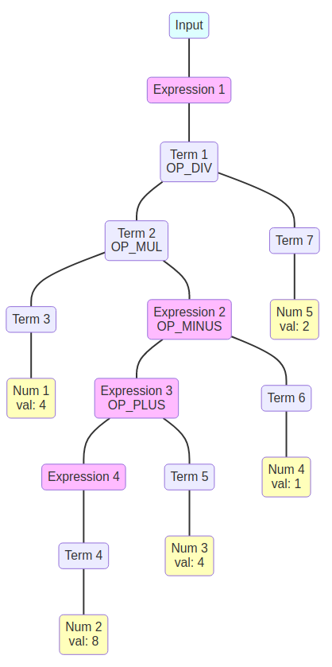

## <center>lab2 实验报告</center>
<center>PB19030801	甘文迪</center>


### 实验要求

1. 编写 `.ll` 文件。 
参考 [gcd_array.c](../../tests/2-ir-gen-warmup/ta_gcd/gcd_array.c) 生成的 `.ll` 文件，学习 `Light IR` 的指令，完成 `.ll` 文件的编写，需要保证用 `lli` 指令测试返回值无误

2. 编写 `.cpp` 文件。
   参考示例文件，学习 `Light IR` 的 cpp 接口，完成 `.cpp` 文件的编写，要求其输出的 `.ll` 文件用 `lli` 指令测试返回值无误

3. 阅读 `tests/2-ir-gen-warmup/calculator`，了解 Visitor Pattern

4. 撰写实验报告，并提交组队信息


### 问题 1	cpp 与 .ll 的对应

说明 cpp 代码片段和 .ll 的每个 BasicBlock 的对应关系。

> 下表显示的对应关系适用于需提交的 .ll 文件以及 .cpp 文件生成的 .ll 文件

|                          .cpp 文件                           |                           .ll 文件                           | 对应关系                                                     |
| :----------------------------------------------------------: | :----------------------------------------------------------: | :----------------------------------------------------------- |
| [assign_generator.cpp](../../tests/2-ir-gen-warmup/stu_cpp/assign_generator.cpp) | [assign_hand.ll](../../tests/2-ir-gen-warmup/stu_ll/assign_hand.ll) | `entry` 对应 .ll 文件中 main 函数里的基本块                  |
| [fun_generator.cpp](../../tests/2-ir-gen-warmup/stu_cpp/fun_generator.cpp) | [fun_hand.ll](../../tests/2-ir-gen-warmup/stu_ll/fun_hand.ll) | callee 函数中的 `entry` 对应 .ll 文件中 callee 函数里的基本块<br />main 函数中的 `entry` 对应 main 函数里的基本块 |
| [if_generator.cpp](../../tests/2-ir-gen-warmup/stu_cpp/if_generator.cpp) | [if_hand.ll](../../tests/2-ir-gen-warmup/stu_ll/if_hand.ll)  | `entry` 对应 .ll 文件中 main 函数里的第一个基本块<br />`trueBasicBlock` 对应第二个基本块<br />`falseBasicBlock` 对应第三个基本块 |
| [while_generator.cpp](../../tests/2-ir-gen-warmup/stu_cpp/while_generator.cpp) | [while_hand.ll](../../tests/2-ir-gen-warmup/stu_ll/while_hand.ll) | `entry` 对应 .ll 文件中 main 函数里的第一个基本块<br />`checkBasicBlock` 对应第二个基本块<br />`whileBasicBlock` 对应第三个基本块<br />`returnBasicBlock` 对应第三个基本块 |


### 问题 2	Visitor Pattern

分析 `calc` 程序在输入为 `4 * (8 + 4 - 1) / 2` 时的行为：
#### 1. 画出该表达式对应的抽象语法树（使用 `calc_ast.hpp` 中的 `CalcAST*` 类型和在该类型中存储的值来表示），并给节点使用数字编号。



#### 2. 指出示例代码在用访问者模式遍历该语法树时的遍历顺序。

<!--序列请按如下格式指明（序号为问题 2.1 中的编号）： 3->2->5->1 -->

[calc_builder.cpp](/home/gwd/文档/课程/大三上/编译原理和技术/Gitlab/2021fall-compiler_cminus/tests/2-ir-gen-warmup/calculator/calc_builder.cpp) 中构建指令时使用后序遍历。即先访问 Term 和 Expression 先访问两端的结点（如果存在），再生成自身对应的中间代码

> 度为 1 的结点没有与生成中间代码相关的操作，因此忽略这些结点

$$
\begin{align}
Num1 &\to Num2 \to Num3 \to Expression3 \to Num4\\
&\to Expression2 \to Term2 \to Num5 \to Term1
\end{align}
$$


### 问题 3	getelementptr

请给出 `IR.md` 中提到的两种 getelementptr 用法的区别，并稍加解释
  - `%2 = getelementptr [10 x i32], [10 x i32]* %1, i32 0, i32 %0`
  - `%2 = getelementptr i32, i32* %1, i32 %0`

第一种用法是确定指向数组 `%1` 中下标为 `%0` 的元素的指针。

第二种用法返回 `i32*` 类型的指针 `%1` 移动 `%0` 个单位后的结果。

> 第一种用法类似于 `int *q = (int*)B+1`，其中 B 为指向数组的指针；第二种用法类似于 `int *q = p+1`。
>
> 第一种用法中 `%1` 指向数组，为了获取其内部的元素（排除越界等特殊情况），第一位偏移为 0，而第二位偏移应设置为 `%0`；第二种用法为了获取指向其他整数的指针，所以其第一位偏移为 `%0`。

可以使用以下代码进行验证。其中，`%4 = getelementptr i32, i32* %2, i32 1` 获取了 %2 的后一个存储单元的值，故返回结果为 20。

```
define i32 @main() #0{
    %1 = alloca [10 x i32]
    %2 = getelementptr [10 x i32], [10 x i32]* %1, i32 0, i32 0
    store i32 10, i32* %2
    %3 = getelementptr [10 x i32], [10 x i32]* %1, i32 0, i32 1
    store i32 20, i32* %3

    %4 = getelementptr i32, i32* %2, i32 1
    %5 = load i32, i32* %4
    ret i32 %5
}
```


### 实验难点

<!--描述在实验中遇到的问题、分析和解决方案。-->

无法表示浮点数：
写成 `float 5.555` 会报错；[Issue 83](http://211.86.152.198/staff/2021fall-notice_board/-/issues/83) 中提到的网页提供的 64 bit double 也无法使用；而 [llvm 的文档](https://llvm.org/docs/LangRef.html#simple-constants) 中提到 `float` 使用 `IEEE 754 single precision`，然而使用单精度格式仍然不能执行成功。最后只能通过参考 `clang` 生成的 `.ll` 文件。

> 希望助教能解释一下 `float` 的规范。


### 实验反馈

<!--吐槽?建议?-->

#### 疑问

`make install` 没有完全运行（用 `sudo`）也能正常进行实验，是在后续的实验中才起作用吗？

#### 建议

建议把 [gcd_array_generator.cpp](../../tests/2-ir-gen-warmup/ta_gcd/gcd_array_generator.cpp) 中的 DEBUG 片段（下面的第一个代码块）改成第二个代码块

```c++
#ifdef DEBUG  // 用于调试信息,大家可以在编译过程中通过" -DDEBUG"来开启这一选项
#define DEBUG_OUTPUT std::cout << __LINE__ << std::endl;  // 输出行号的简单示例
#else
#define DEBUG_OUTPUT
#endif
```

```c++
#define DEBUG_OUTPUT std::clog << __LINE__ << std::endl;  // 输出行号的简单示例
```

- 个人认为修改代码（将 `DEBUG_OUTPUT` 的内容注释掉）比添加编译选项 `-DDEBUG` 方便一些
- 建议使用 `std::cerr` 或 `std::clog` 输出到 `stderr`，因为使用 `std::cout` 可能会干扰调试时获得的程序结果（例如执行 `./stu_assign_generator | lli` 时会失败）


### 运行 result.ll

为运行 `result.ll`，需要在 build 目录下执行以下命令

```bash
clang -shared -o io.so ../src/io/io.c
lli --load=$(pwd)/io.so result.ll
```

**解决过程**：

查看 result.ll 发现缺少 output 函数

查看 calc.cpp 发现生成 result 时运行的命令为 `clang -O0 -w result.ll -o result -L. -lcminus_io`，推测 output 函数出现在 `src/io/io.c` 中

根据 [LLVM documentation](https://llvm.org/docs/CommandGuide/lli.html)，很可能使用 `--load` 链接文件；而为了产生用于链接的文件，在此之前需要使用 `clang -shared` 编译 `src/io/io.c`


### 实验总结

通过此次实验我学习了一些 `LLVM IR` 指令及其 cpp 接口的编写规范，并了解了访问者模式。

此外，我学习了调试 C++ 的技巧，例如查看调用堆栈。
