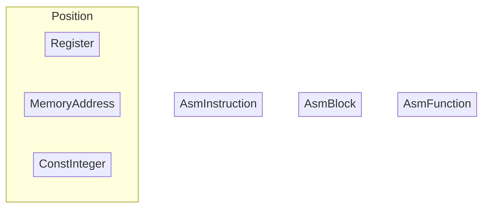
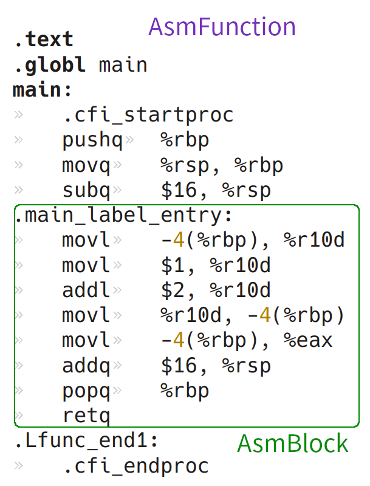

<style>
    @import './format.css';
</style>


# <center>Lab5 后端代码的生成</center>
<center>甘文迪 PB19030801</center>

---

## 目标

将 `Light IR` 翻译成 x86_64 汇编指令，用 `clang` 产生可执行文件。

> 需要开启 `-mem2reg` 优化选项

---

## 设计

### 类

+ `Position` 表示存储位置，主要种类有 `Register`, `MemoryAddress`, `ConstInteger`
+ `AsmInstruction` 表示汇编语句
+ `AsmBlock` 表示汇编语句块
+ `AsmFunction` 表示汇编函数

<center></center>

---

<div class="columnsThree fit">
<div class="verticalCenter horizontalCenter">

```c
int main(void) {
    int a;
    a = 1 + 2;
    return a;
}
```

</div>

<div class="verticalCenter horizontalCenter">
<i class="arrow right"></i>
</div>

<div>


<center></center>


---

### 基本的函数

```c++
void updateRegister(Value* value);         // 使用 LRU 更新寄存器状态
MemoryAddress& getAddress(Value* value);   // 获取地址，否则开辟地址
Register& getEmptyRegister(Value* value);  // 获得空的寄存器
Position& getPosition(Value* value);  // 寻找位置，优先给出常量、寄存器，否则取内存地址
```

#### 寄存器分配

分别选择以下寄存器作为整数和浮点数变量的临时寄存器

```
r10d, r11d, r12d, r13d, r14d, r15d
xmm8, xmm9, xmm10, xmm11, xmm12, xmm13, xmm14, xmm15
```

当请求或使用寄存器时，用 `updateRegister` 进行更新。
当尝试用一个 value 去请求空的寄存器时，若寄存器存有其他值，则将其转移到内存后再请求。


---

### 各种指令的翻译

1. [运算](#1-运算)
    + [数值](#数值运算)
    + [比较](#比较运算)
    + [类型转换](#类型转换)
2. [跳转及 phi](#2-跳转及-phi)
3. [函数](#3-函数)
   + [返回](#返回语句)
   + [函数起始部分](#函数起始部分)
   + [调用](#调用语句)
4. [指针相关](#4-指针相关)
---

#### 1. 运算


##### 数值运算

<div class=columnsTwo>
<div>

###### 以整数加法为例

参考 `clang -S` 生成的代码

```assembly
a = 1 + 2;
```

```assembly
    movl    $1, %r10d
    addl    $2, %r10d
```

```c++
    auto reg = getEmptyRegister(instruction);
    appendInst(movl, getPosition(value1), reg);
    appendInst(addl, getPosition(value2), reg);
```

</div>
<div class="verticalCenter horizontalCenter">

| 汇编指令 | 含义     |
| -------- | -------- |
| `addl`   | 整数加   |
| `subl`   | 整数减   |
| `imull`  | 整数乘   |
| `addss`  | 浮点数加 |
| `subss`  | 浮点数减 |
| `mulss`  | 浮点数乘 |
| `divss`  | 浮点数除 |

---


###### 1. 浮点数常量的表示

> 函数开头部分加上
>
> ```assembly
> .main_0:
>     .long    1067030938
> ```
>

调用时使用 `.main_0(%rip)`


###### 2. 整数除法

<div class="columnsThree fit">

<div class="verticalCenter horizontalCenter">

```c
a = 9 / 4;
```

</div>

<div class="verticalCenter horizontalCenter">
<i class="arrow right"></i>
</div>

<div class="verticalCenter horizontalCenter">

```assembly
    movq    $9, %rax
    movl    $4, %r10d
    cltd
    idivl    %r10d
    movl    %eax, %r10d
```

---

<div class=columnsTwo>
<div>

##### 比较运算

###### 整数比较

`2 > 1` 翻译成

```assembly
    movl    $2, %eax
    cmpl    $1, %eax
    setg    %cl
    movzbl  %cl, %r10d
```

###### 浮点数比较

```assembly
    movss   .main_0(%rip), %xmm8
    ucomiss .main_1(%rip), %xmm8
    seta    %cl
    movzbl  %cl, %r10d
```

> 零扩展 `zext` 部分不生成汇编代码

</div>
<div>
<div>

<br>

##### 类型转换

###### `fptosi`

```assembly
    cvttss2si    %xmm8, %r10d
```
<br>

###### `sitofp`

```assembly
    movl         $1, %eax
    cvtsi2ssl    %eax, %xmm8
```

---

#### 2. 跳转及 phi

##### 跳转语句

> 在每个 `AsmBlock` 前需加上编号
>
> ```assembly
> .main_label2:
> ```

###### 无条件

<div class="columnsThree fit">
<div class="verticalCenter horizontalCenter">


```assembly
  br label %label1
```
</div>

<div class="verticalCenter horizontalCenter">
<i class="arrow right"></i>
</div>

<div class="verticalCenter horizontalCenter">

```assembly
    jmp    .main_label1
```
</div>
</div>

###### 有条件

<div class="columnsThree fit">
<div class="verticalCenter horizontalCenter">

```assembly
  %op5 = icmp ne i32 %op4, 0
  br i1 %op5, label %label6, label %label9
```

</div>

<div class="verticalCenter horizontalCenter">
<i class="arrow right"></i>
</div>

<div class="verticalCenter horizontalCenter">

```assembly
    cmpl    $0, %r12d
    jne     .main_label6
    jmp     .main_label9
```

---

<div class=columnsTwo>
<div>

##### phi 语句

直接在来自的基本块的末尾加指令存在问题。因为如果这个基本块在后方，还未进行处理，其中还没有指令，会在最前面生成指令。

因此增加 `endInstructions`，用于存储基本块的返回、跳转、phi 语句的翻译结果。翻译时在来自的基本块 `endInstructions` 的最前面插入 `movl` 指令。
</div>

<div>
<div class="verticalCenter horizontalCenter">

```assembly
.main_label_entry:


    movl    %eax, -4(%rbp)
    jmp        .main_label1
.main_label1:
    movl    -12(%rbp), %r10d
    movl    -4(%rbp), %eax


.main_label6:


    movl    %eax, -4(%rbp)
    jmp        .main_label1
```
</div>

<div class="verticalCenter horizontalCenter">
<i class="arrow up"></i>
</div>

</div>
</div>

<div class="verticalCenter horizontalRight">

```assembly
label1:
  %op11 = phi i32 [ 10, %label_entry ], [ %op8, %label6 ]
```

</div>


---


<div class=columnsTwo>
<div>
<div class="emphasize">

#### 3. 函数

+ 返回语句 `ret`
+ 函数起始部分
+ 调用语句 `call`（详细）

</div>

<br>


##### 返回语句

<div class="columnsThree fit">
<div class="verticalCenter horizontalCenter">


```assembly
  ret i32 3
```

</div>

<div class="verticalCenter horizontalCenter">
<i class="arrow right"></i>
</div>

<div class="verticalCenter horizontalCenter">

```assembly
    movl    $3, %eax
    addq    $16, %rsp
    popq    %rbp
    retq
```

</div>
</div>

> 临时空间的大小需要全部扫描后才能确定，最后再生成返回语句

</div>
<div>

##### 函数起始部分

处理栈指针

    pushq   %rbp
    movq    %rsp, %rbp
    subq    $16, %rsp

将参数移入内存

---

##### 调用语句

对于整数参数，参数优先进入寄存器 `edi, esi, edx, ecx, r8d, r9d`，否则压入栈

```c++
FOR (i, 1, operandNumber - 1) {
    Position& position = getPosition(operands[i]);
    auto type = operands[i]->get_type();
    if (type == int32Type) {
        if (intRegisterIndex < argIntRegister.size())
            appendInst(movl, position, *argIntRegister[intRegisterIndex++]);
        else
            appendInst(pushq, position);
    }
}
```

---

保存寄存器的值，然后调用函数

```c++
    stash();
    appendInst(call, Position(callFunctionName));
```

获取返回值，扣除参数占用的栈空间

```c++
    if (returnType == int32Type)
        appendInst(movl, eax, getEmptyRegister(instruction));
    else if (returnType == floatType)
        appendInst(movss, xmm0, getEmptyRegister(instruction));
    if (operandNumber >= 7)
        appendInst(addq, ConstInteger(8 * (operandNumber - 7)), rsp);  // pop
```

> 浮点数及指针类似

---

#### 4. 指针相关

> 由于开启了 `-mem2reg` 优化选项，不考虑局部的指针变量

<br>

<div class="fit">

<div class="small horizontalCenter">不同类型的数组或指针可用的指令</div>

|                 | 数组 | 指针 |   全局变量   |
| :-------------: | :--: | :--: | :----------: |
|    `alloca`     |  ✅   |      |              |
|     `load`      |      |  ✅   |      ✅       |
|     `store`     |      |  ✅   |      ✅       |
| `getelementptr` |  ✅   |  ✅   | 全局数组可以 |

---

##### 数组

###### alloca

先获取空间，再设置值 `instruction` 对应指针的地址

```c++
if (allocaType->get_type_id() == Type::ArrayTyID) {
    auto arrayType = static_cast<ArrayType*>(allocaType);
    int nums = arrayType->get_num_of_elements();
    stackSpace += nums * 4;
}
getAddress(instruction);
```


|       栈增长方向 🠕       |
| :----------------------: |
| 指向数组的指针（8 字节） |
|     数组（400 字节）     |

---

<div class=columnsTwo>
<div>

###### getelementptr

由于 cminus 的数组只有一维，且 `int` `float` 均占用 4 字节，数组和指针均可用
`ans = pointer + 4 * index` 来计算偏移。

</div>

<div>

<br>
<br>

```assembly
    movq    -416(%rbp), %r11
    movl    $1, %eax
    imull   $4, %eax
    addq    %rax, %r11
```

<div class="verticalCenter horizontalCenter">
<i class="arrow up"></i>
</div>

</div>
</div>

<div class="verticalCenter horizontalRight">

```assembly
    %op8 = getelementptr [100 x i32], [100 x i32]* %op0, i32 0, i32 1
```


---

<div class=columnsTwo>
<div>

##### 指针

###### load

用 `%rax` 临时存储地址，用 `0(%rax)` 获取值


```assembly
    %op9 = load i32, i32* %op8
```


<div class="verticalCenter horizontalCenter">
<i class="arrow down"></i>
</div>

<br>

```assembly
    movq    -16(%rbp), %rax
    movq    0(%rax), %r11
```

> `store` 语句同理

</div>
<div>

##### 全局变量

需要在生成的代码开始处添加 `.comm`

```assembly
.comm   x,400,4
```

为了统一非数组和数组，在**函数开始处**获取其存储的地址，后续它们的处理方式与指针类似。

```assembly
    leaq    x(%rip), %rax
    movq    %rax, -40(%rbp)
```

> 不能在编译器第一次执行到时获取其存储位置，因为编译器第一次执行到未必是程序第一次执行到

</div>

---

### 测试

可以通过 lab3 的所有测试文件

<br>

### 存在的问题

+ 某些样例可能无法通过
+ 产生了许多冗余的 `mov` 等指令
+ 代码有些混乱

---

### 收获

+ 了解了 x86_64 汇编语言，学习使用汇编调试工具（例如 edb）
+ 加深了对后端的理解
+ 提高了编程能力

<br>

### 备注

Lab5 的代码公开至 https://github.com/GWDx/Compiler-Cminus

---

## <center>谢谢观看！</center>
